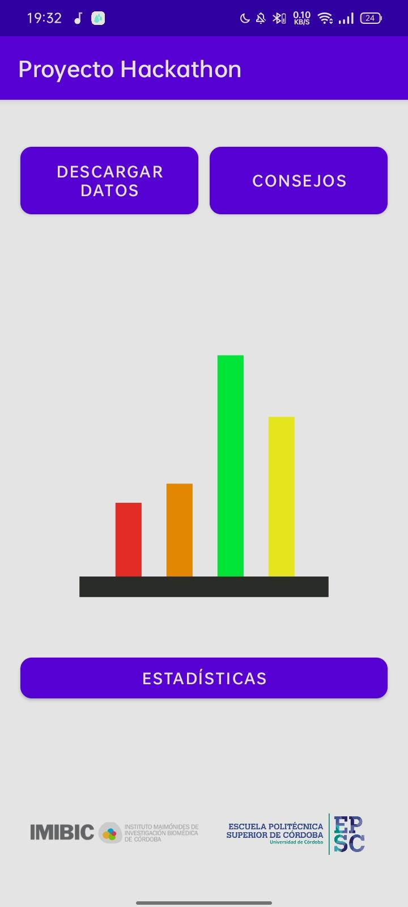
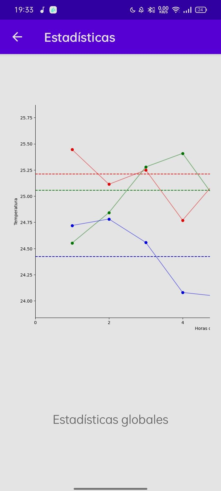
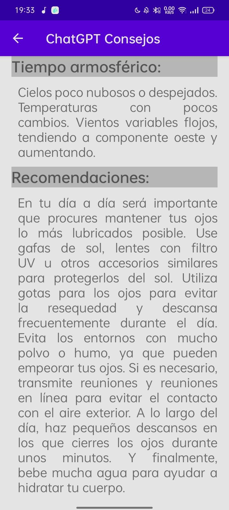

# Proyecto-Hackathon
## About

This is a project created for the 1st Hackathon organized by [IMIBIC](https://www.imibic.org/) and [EPSC](https://www.uco.es/eps/es/).
This app was part of the prototype device the group I was working with designed for the challenge named "Dry eye treatment monitoring device". [Link to article](https://www.eldiadecordoba.es/cordoba/Imibic-hackaton-biotecnologico-Andalucia_0_1776723567.html)

The prototype was made up by this app and some glasses. These glasses check the environmental humidity, luminosity, temperature and some gases (e.g. CO2) and then
warn the patient whether they are or not in a dangerous environent. The app connects with these glases via Bluetooth to download and store the collected data.

## Features
- ChatGPT Integration
- History of the characteristics of the places you visited

## Screenshots

|  |  |  |
|:---:|:---:|:---:|
| Initial view | Graph view | ChatGPT advices |
